

## Apartado A

1. 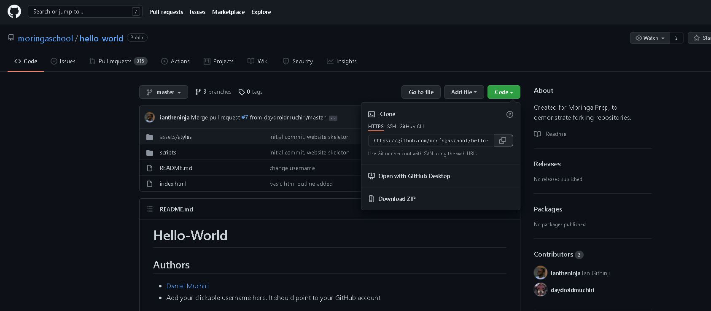 

Copiamos el link del repo para el clone

2. 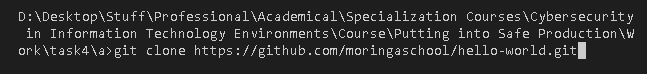 

Hacemos el clone

3. 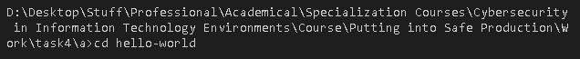 

Entramos a la carpeta del repo en local

4. 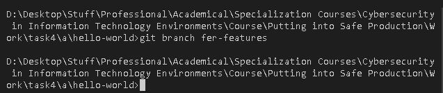 

Creamos una rama

5. 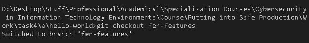 

Nos cambiamos a nuestra nueva rama

6. 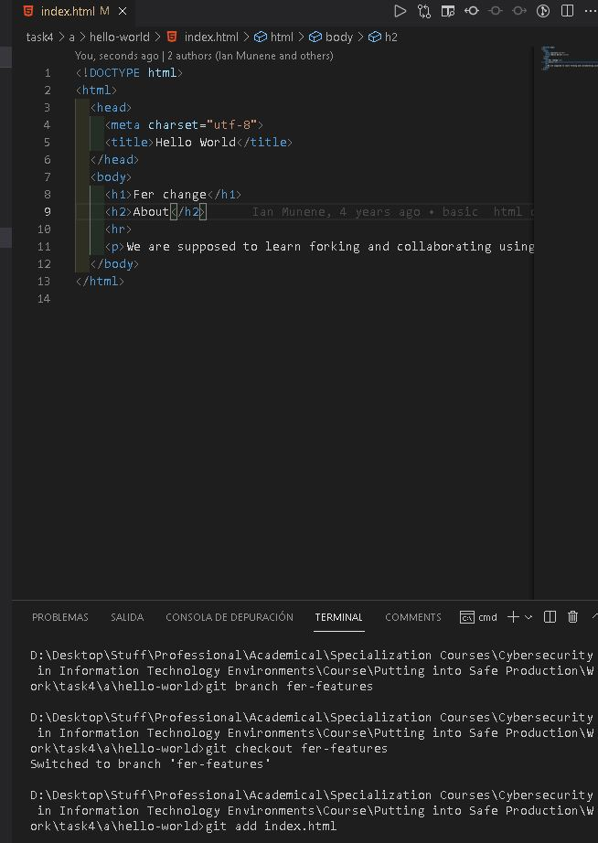 

Hacemos cambios y los añadimos con git add

7. 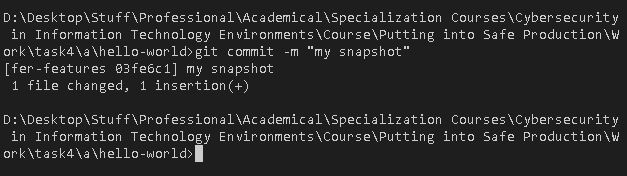 

Hacemos commit

8. 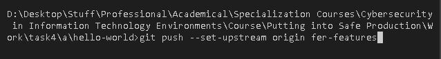 

Subimos los cambios

## Apartado B (Junté el segundo y tercer ejemplo porque son lo mismo)

1. 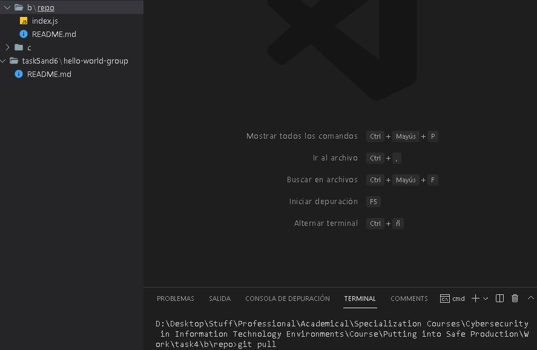 

Hacemos pull del remote repo

2.  

Cambiamos de branch

3. 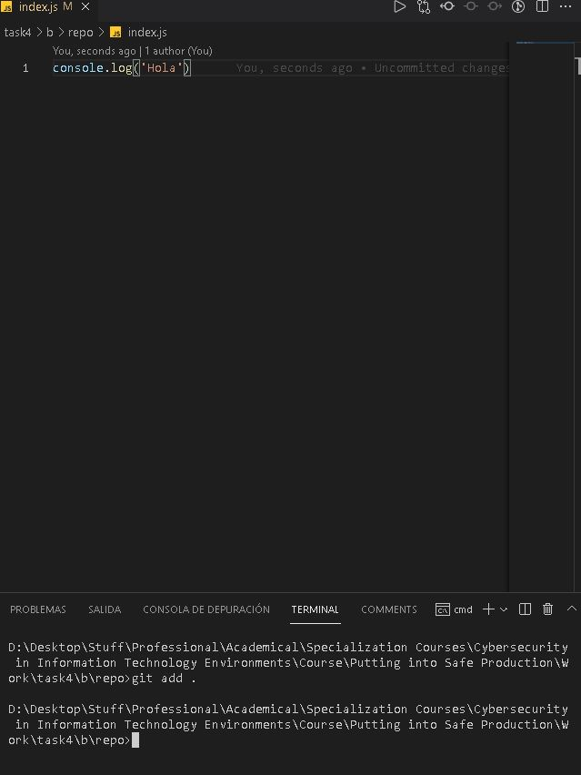 

Hacemos cambios y hacemos el add .

4. 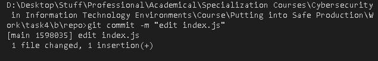 

Hacemos commit

5. 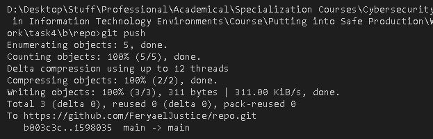 

Hacemos push